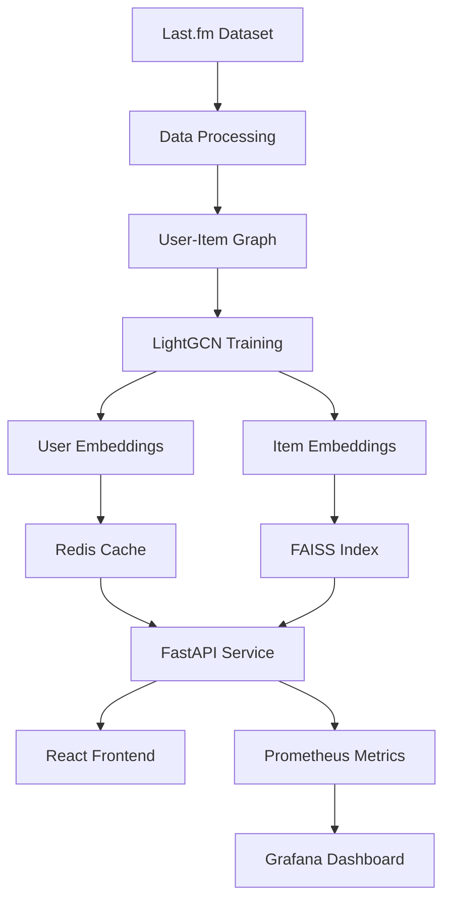

# TunedIn Architecture

## System Overview

TunedIn is a production-quality music recommendation system that combines collaborative filtering with content-based features. The system is designed for scalability, observability, and maintainability.

## Architecture Components

### 1. Data Pipeline

- **Data Source**: Last.fm dataset (user-artist interactions)
- **Processing**: Pandas-based ETL pipeline
- **Storage**: Parquet files for efficient loading
- **Graph Construction**: User-item bipartite graph

### 2. ML Pipeline

- **Model**: LightGCN (Light Graph Convolutional Network)
- **Framework**: PyTorch Geometric
- **Training**: BPR (Bayesian Personalized Ranking) loss
- **Output**: User and item embeddings (64-dimensional)

### 3. Serving Layer

- **API**: FastAPI with async support
- **Search**: FAISS HNSW index for approximate nearest neighbors
- **Caching**: Redis for user embeddings and recent history
- **Reranking**: Diversity and freshness heuristics

### 4. Frontend

- **Framework**: React with TypeScript
- **Build Tool**: Vite
- **State Management**: Zustand
- **UI**: Modern, responsive design

### 5. Infrastructure

- **Containerization**: Docker Compose
- **Monitoring**: Prometheus + Grafana
- **CI/CD**: GitHub Actions
- **Development**: Make-based automation

## Data Flow



## Key Design Decisions

### Model Architecture

- **LightGCN**: Chosen for simplicity and effectiveness on implicit feedback
- **Embedding Dimension**: 64 (balance between expressiveness and efficiency)
- **Layers**: 3 (sufficient for most recommendation tasks)

### Serving Architecture

- **FAISS HNSW**: Better recall than IVF-PQ for recommendation quality
- **Redis Caching**: User embeddings cached for 24 hours
- **Async Processing**: Non-blocking I/O for better throughput

### Scalability Considerations

- **Horizontal Scaling**: Stateless API design
- **Caching Strategy**: Multi-level caching (Redis + in-memory)
- **Database**: PostgreSQL for persistent storage (future)
- **Message Queue**: Kafka for real-time feedback (future)

## Performance Characteristics

### Latency Targets

- **p50**: < 50ms
- **p95**: < 100ms
- **p99**: < 150ms

### Throughput

- **Target**: 1000 requests/second
- **Bottleneck**: FAISS search (optimized with HNSW)

### Memory Usage

- **FAISS Index**: ~100MB for 10K items
- **User Embeddings**: ~1MB for 1K users
- **Redis Cache**: ~10MB typical usage

## Monitoring & Observability

### Metrics

- **Request Rate**: Requests per second
- **Latency**: p50, p95, p99 response times
- **FAISS Performance**: Search latency
- **Cache Hit Ratio**: Redis efficiency
- **Error Rate**: 4xx and 5xx responses

### Logging

- **Structured Logs**: JSON format
- **Request Tracing**: Correlation IDs
- **Error Tracking**: Stack traces and context

### Alerting

- **High Latency**: p99 > 200ms
- **High Error Rate**: > 5% errors
- **Cache Miss**: Hit ratio < 70%
- **Service Down**: Health check failures

## Security Considerations

### API Security

- **Rate Limiting**: Per-user request limits
- **Input Validation**: Pydantic schemas
- **CORS**: Configured for frontend domains

### Data Privacy

- **User Data**: Minimal collection (user_id only)
- **Feedback**: Anonymized interaction logs
- **GDPR Compliance**: Data deletion capabilities

## Deployment

### Development

```bash
make pipeline  # Full setup
make up        # Start services
```

### Production

- **Container Registry**: Docker Hub or private registry
- **Orchestration**: Kubernetes or Docker Swarm
- **Load Balancing**: Nginx or cloud load balancer
- **SSL/TLS**: Let's Encrypt or cloud certificates

## Future Enhancements

### Short Term

- [ ] Real-time feedback processing
- [ ] A/B testing framework
- [ ] Advanced reranking algorithms
- [ ] Content-based features

### Long Term

- [ ] Multi-armed bandits
- [ ] Deep learning models
- [ ] Audio feature extraction
- [ ] Cross-domain recommendations
