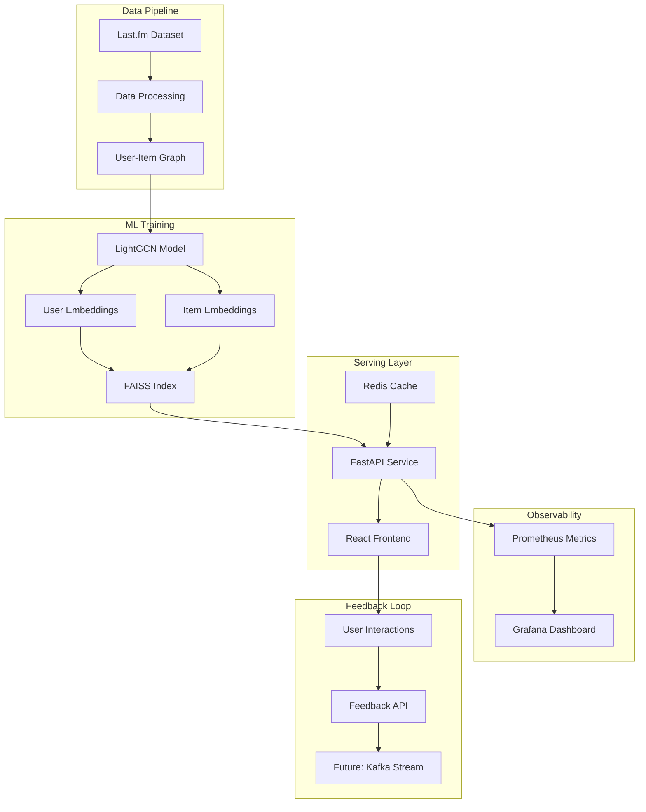

# TunedIn - AI Music Recommender

A production-quality music recommendation system that combines collaborative filtering with content-based features for personalized music discovery.

## Key Performance Indicators

- **nDCG@10**: > 0.45 (Normalized Discounted Cumulative Gain)
- **HR@10**: > 0.35 (Hit Rate at 10 recommendations)
- **p99 Latency**: < 150ms (99th percentile response time)
- **Cache Hit Ratio**: > 80% (Redis cache efficiency)

## Architecture



## Quick Start

### Prerequisites

- Docker & Docker Compose
- Make (optional, for convenience commands)

### Setup & Training

1. **Clone and configure**:

   ```bash
   git clone <repo-url>
   cd tunedin
   cp env.example .env
   ```

2. **Download sample data**:

   ```bash
   make seed
   ```

3. **Train the model**:

   ```bash
   make train
   ```

4. **Export embeddings**:

   ```bash
   make export
   ```

5. **Build FAISS index**:

   ```bash
   make faiss
   ```

6. **Start services**:

   ```bash
   make up
   ```

7. **Access the application**:
   - Frontend: http://localhost:5173
   - Backend API: http://localhost:8000
   - Prometheus: http://localhost:9090
   - Grafana: http://localhost:3001

### Test the API

```bash
# Get recommendations for user 1
curl "http://localhost:8000/rec/users/1?n=10"

# Submit feedback
curl -X POST "http://localhost:8000/feedback" \
  -H "Content-Type: application/json" \
  -d '{"user_id": 1, "track_id": "track_123", "event": "like", "ts": 1640995200}'

# Health check
curl "http://localhost:8000/healthz"
```

## API Endpoints

### Recommendations

- `GET /rec/users/{user_id}?n=50` - Get personalized recommendations
- `GET /rec/users/{user_id}/similar?n=20` - Get similar users

### Feedback

- `POST /feedback` - Submit user interaction (play, like, skip)

### System

- `GET /healthz` - Health check endpoint
- `GET /metrics` - Prometheus metrics

## Frontend Features

- **Discover Page**: Personalized music recommendations with like/skip actions
- **Track Details**: Detailed view with artist information and tags
- **Playlist Management**: Save and organize favorite tracks
- **Real-time Updates**: Instant feedback submission and UI updates

## Observability

### Metrics Dashboard

- Request rate and latency (p50, p95, p99)
- FAISS search performance
- Cache hit ratios
- Error rates and status codes

### Logging

- Structured JSON logs
- Request tracing with correlation IDs
- Performance monitoring

## Development

### Project Structure

```
tunedin/
├── backend/          # FastAPI service
├── ml/              # PyTorch Geometric models
├── frontend/        # React + Vite + TypeScript
├── docker/          # Docker Compose & monitoring
├── infra/           # Infrastructure automation
└── .github/         # CI/CD workflows
```

### Key Technologies

- **Backend**: FastAPI, Redis, FAISS, Prometheus
- **ML**: PyTorch Geometric, LightGCN, BPR Loss
- **Frontend**: React, TypeScript, Vite, Zustand
- **Infrastructure**: Docker, Prometheus, Grafana

## Model Architecture

### LightGCN (Light Graph Convolutional Network)

- **Collaborative Filtering**: User-item interaction graph
- **Embedding Propagation**: Multi-layer message passing
- **BPR Loss**: Bayesian Personalized Ranking for implicit feedback
- **Cold Start**: Content embeddings for new users/items

### Hybrid Approach

- **Collaborative**: User-item co-occurrence patterns
- **Content**: Audio features + text metadata
- **Fusion**: Weighted combination (α=0.7 collaborative, 1-α content)

## Performance Optimizations

- **FAISS HNSW**: Approximate nearest neighbor search
- **Redis Caching**: User embeddings and recent history
- **Async Processing**: Non-blocking I/O operations
- **Batch Inference**: Efficient embedding lookups

## Trade-offs & Design Decisions

### Model Selection

- **LightGCN vs GraphSAGE**: LightGCN chosen for simplicity and effectiveness on implicit feedback
- **HNSW vs IVF-PQ**: HNSW for better recall, IVF-PQ for memory efficiency

### Serving Architecture

- **Online vs Offline**: Hybrid approach with pre-computed embeddings + real-time reranking
- **Cache Strategy**: User embeddings cached, item embeddings served from disk

### Fusion Strategy

- **α Parameter**: Tunable weight between collaborative and content signals
- **Cold Start**: Content-only recommendations for new users

## Next Steps

- [ ] **A/B Testing Framework**: Compare model variants in production
- [ ] **Real-time Feedback Loop**: Kafka streaming for immediate model updates
- [ ] **Multi-armed Bandits**: Explore-exploit for new content discovery
- [ ] **Scalability**: Horizontal scaling with load balancers
- [ ] **Advanced Features**: Session-based recommendations, playlist generation
- [ ] **Content Understanding**: Audio feature extraction with librosa
- [ ] **Diversity Metrics**: Ensure recommendation diversity and fairness

## What I Learned

_This section will be populated with insights gained during development:_

- **Graph Neural Networks**: LightGCN's effectiveness on implicit feedback datasets
- **Production ML**: Balancing model complexity with serving latency
- **Observability**: Importance of comprehensive metrics for ML systems
- **User Experience**: Real-time feedback loops improve recommendation quality
