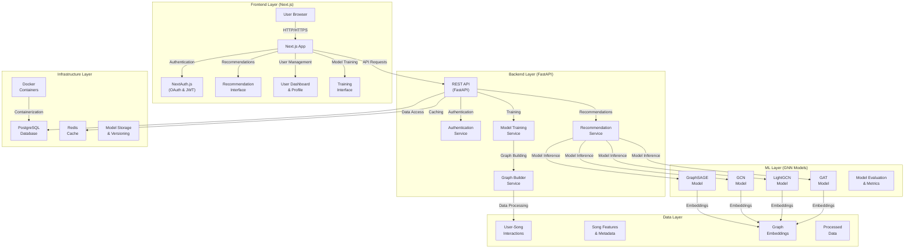
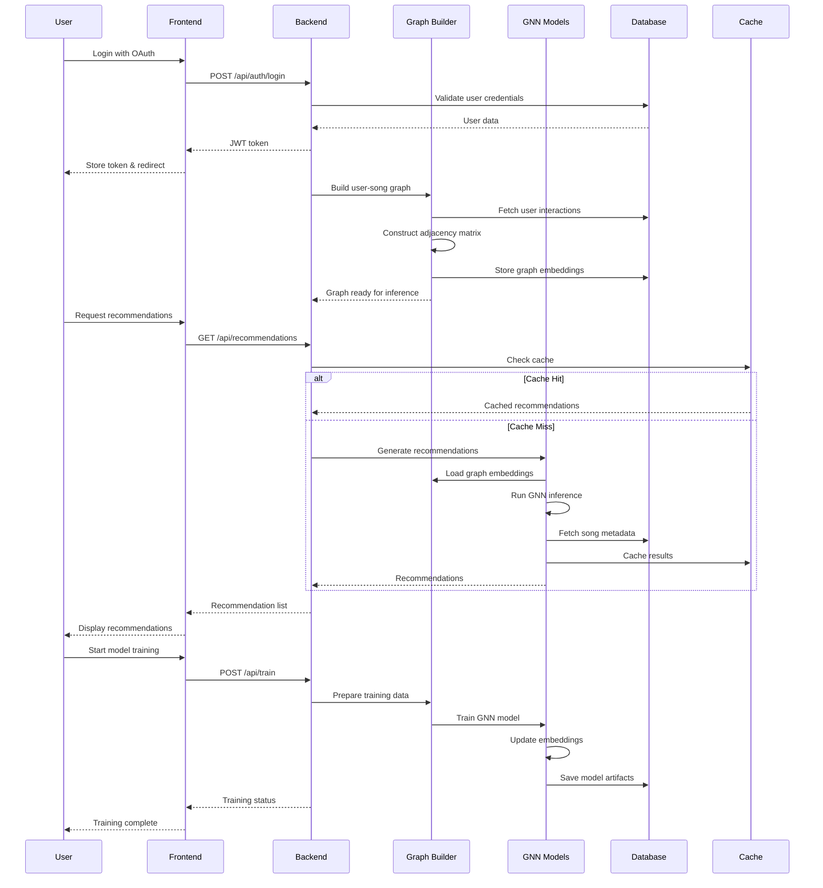

# TunedIn

A music recommendation system built with Graph Neural Networks (GNNs), FastAPI backend, and Next.js frontend. Features collaborative filtering, content-based filtering, and advanced graph-based recommendations using various GNN architectures.

---

## Architecture


```mermaid
graph TD
    %% Frontend Layer
    subgraph "Frontend Layer (Next.js)"
        A1["User Browser"] -->|"HTTP/HTTPS"| A2["Next.js App"]
        A2 -->|"Authentication"| A3["NextAuth.js<br>(OAuth & JWT)"]
        A2 -->|"Recommendations"| A4["Recommendation<br>Interface"]
        A2 -->|"User Management"| A5["User Dashboard<br>& Profile"]
        A2 -->|"Model Training"| A6["Training<br>Interface"]
    end

    %% Backend Layer
    subgraph "Backend Layer (FastAPI)"
        B1["REST API<br>(FastAPI)"]
        B2["Authentication<br>Service"]
        B3["Recommendation<br>Service"]
        B4["Model Training<br>Service"]
        B5["Graph Builder<br>Service"]
    end

    %% ML Layer
    subgraph "ML Layer (GNN Models)"
        C1["GraphSAGE<br>Model"]
        C2["GCN<br>Model"]
        C3["LightGCN<br>Model"]
        C4["GAT<br>Model"]
        C5["Model Evaluation<br>& Metrics"]
    end

    %% Data Layer
    subgraph "Data Layer"
        D1["User-Song<br>Interactions"]
        D2["Song Features<br>& Metadata"]
        D3["Graph<br>Embeddings"]
        D4["Processed<br>Data"]
    end

    %% Infrastructure Layer
    subgraph "Infrastructure Layer"
        E1["Docker<br>Containers"]
        E2["PostgreSQL<br>Database"]
        E3["Redis<br>Cache"]
        E4["Model Storage<br>& Versioning"]
    end

    %% Cross-layer connections
    A2 -->|"API Requests"| B1
    B1 -->|"Authentication"| B2
    B1 -->|"Recommendations"| B3
    B1 -->|"Training"| B4
    B3 -->|"Model Inference"| C1
    B3 -->|"Model Inference"| C2
    B3 -->|"Model Inference"| C3
    B3 -->|"Model Inference"| C4
    B4 -->|"Graph Building"| B5
    B5 -->|"Data Processing"| D1
    C1 -->|"Embeddings"| D3
    C2 -->|"Embeddings"| D3
    C3 -->|"Embeddings"| D3
    C4 -->|"Embeddings"| D3
    B1 -->|"Data Access"| E2
    B1 -->|"Caching"| E3
    E1 -->|"Containerization"| E2
```

---

## System Overview

TunedIn implements a modern music recommendation system with a layered architecture that combines collaborative filtering, content-based filtering, and advanced graph neural networks:

### **Frontend Layer**

- **Next.js App**: Modern React-based interface with TypeScript
- **NextAuth.js**: OAuth authentication with multiple providers
- **Recommendation Interface**: Interactive song discovery and recommendation display
- **User Dashboard**: Personalized user profiles and listening history
- **Training Interface**: Real-time model training monitoring and control

### **Backend Layer**

- **FastAPI**: High-performance REST API with automatic documentation
- **Authentication Service**: JWT-based authentication with OAuth integration
- **Recommendation Service**: Multi-model recommendation engine
- **Model Training Service**: Asynchronous model training and evaluation
- **Graph Builder Service**: Dynamic graph construction from user interactions

### **ML Layer**

- **GraphSAGE**: Inductive graph neural network for large-scale graphs
- **GCN**: Graph Convolutional Network for node classification
- **LightGCN**: Lightweight graph convolutional network for recommendations
- **GAT**: Graph Attention Network with attention mechanisms
- **Model Evaluation**: Comprehensive metrics including precision, recall, NDCG

### **Data Layer**

- **User-Song Interactions**: Collaborative filtering data from user listening patterns
- **Song Features**: Content-based features including audio characteristics
- **Graph Embeddings**: Learned representations for users and songs
- **Processed Data**: Cleaned and normalized datasets for training

### **Infrastructure Layer**

- **Docker**: Containerized deployment with Docker Compose
- **PostgreSQL**: Primary database for user data and metadata
- **Redis**: Caching layer for recommendations and session data
- **Model Storage**: Versioned model artifacts and embeddings

The system supports multiple recommendation approaches:

1. **Collaborative Filtering**: Based on user-user and item-item similarities
2. **Content-Based Filtering**: Using song features and metadata
3. **Graph-Based Recommendations**: Leveraging GNN architectures for complex patterns
4. **Hybrid Approaches**: Combining multiple recommendation strategies

---

## Data Flow


```mermaid
sequenceDiagram
    participant U as User
    participant F as Frontend
    participant B as Backend
    participant G as Graph Builder
    participant M as GNN Models
    participant D as Database
    participant C as Cache

    %% User Authentication
    U->>F: Login with OAuth
    F->>B: POST /api/auth/login
    B->>D: Validate user credentials
    D-->>B: User data
    B-->>F: JWT token
    F-->>U: Store token & redirect

    %% Graph Construction
    B->>G: Build user-song graph
    G->>D: Fetch user interactions
    G->>G: Construct adjacency matrix
    G->>D: Store graph embeddings
    G-->>B: Graph ready for inference

    %% Recommendation Generation
    U->>F: Request recommendations
    F->>B: GET /api/recommendations
    B->>C: Check cache
    alt Cache Hit
        C-->>B: Cached recommendations
    else Cache Miss
        B->>M: Generate recommendations
        M->>G: Load graph embeddings
        M->>M: Run GNN inference
        M->>D: Fetch song metadata
        M->>C: Cache results
        M-->>B: Recommendations
    end
    B-->>F: Recommendation list
    F-->>U: Display recommendations

    %% Model Training
    U->>F: Start model training
    F->>B: POST /api/train
    B->>G: Prepare training data
    G->>M: Train GNN model
    M->>M: Update embeddings
    M->>D: Save model artifacts
    B-->>F: Training status
    F-->>U: Training complete
```

---

## Features

- **Multi-Model Recommendations**: Support for GraphSAGE, GCN, LightGCN, and GAT
- **Real-time Training**: Asynchronous model training with progress monitoring
- **Graph-based Learning**: Dynamic graph construction from user interactions
- **OAuth Authentication**: Secure login with multiple providers
- **Interactive Dashboard**: Real-time recommendation exploration
- **Model Evaluation**: Comprehensive metrics and performance tracking
- **Scalable Architecture**: Docker-based deployment with horizontal scaling
- **API Documentation**: Automatic OpenAPI documentation with FastAPI
- **Caching Layer**: Redis-based recommendation caching
- **Model Versioning**: Track and manage different model versions

---

## Tech Stack

- **Frontend**: Next.js 14, TypeScript, Tailwind CSS, NextAuth.js
- **Backend**: FastAPI, Python 3.11+, Uvicorn, SQLAlchemy
- **Database**: PostgreSQL 15, Redis 7
- **ML/AI**: PyTorch, PyTorch Geometric, NetworkX, Scikit-learn
- **Container**: Docker, Docker Compose
- **Authentication**: NextAuth.js, JWT, OAuth providers
- **Testing**: Jest, Playwright, Pytest
- **Monitoring**: Health checks, metrics collection

---

## Quick Start

### Prerequisites

- Docker and Docker Compose
- Python 3.11+
- Node.js 18+

### 1. Clone and Setup

```bash
git clone <repository-url>
cd tunedin
```

### 2. Start the System

```bash
docker-compose up -d
```

This will start:

- PostgreSQL database on port 5432
- Redis cache on port 6379
- FastAPI backend on port 8000
- Next.js frontend on port 3000

### 3. Verify Installation

```bash
# Check if services are running
docker-compose ps

# Test the API
curl http://localhost:8000/api/health
```

### 4. Access the Application

- **Frontend**: http://localhost:3000
- **Backend API**: http://localhost:8000/api
- **API Documentation**: http://localhost:8000/docs
- **Health Check**: http://localhost:8000/api/health

---

## API Endpoints

### Authentication

- `POST /api/auth/login` - User login with OAuth
- `POST /api/auth/logout` - User logout
- `GET /api/auth/session` - Get current session

### Recommendations

- `GET /api/recommendations/user/{user_id}` - Get user recommendations
- `GET /api/recommendations/song/{song_id}` - Get similar songs
- `POST /api/recommendations/hybrid` - Hybrid recommendations
- `GET /api/recommendations/explore` - Discovery recommendations

### Model Management

- `POST /api/train` - Start model training
- `GET /api/train/status` - Get training status
- `GET /api/models` - List available models
- `GET /api/models/{model_id}` - Get model details
- `POST /api/models/{model_id}/activate` - Activate model

### User Management

- `GET /api/users/profile` - Get user profile
- `PUT /api/users/profile` - Update user profile
- `GET /api/users/history` - Get listening history
- `POST /api/users/interactions` - Record user interaction

---

## Development

### Local Development

```bash
# Start dependencies
docker-compose up postgres redis -d

# Run backend
cd backend
python -m venv venv
source venv/bin/activate  # On Windows: venv\Scripts\activate
pip install -r requirements.txt
uvicorn api.server:app --reload

# Run frontend
cd frontend
npm install
npm run dev
```

### Testing

```bash
# Run backend tests
cd backend
pytest

# Run frontend tests
cd frontend
npm test

# Run integration tests
npm run test:e2e
```

---

## Model Architecture

### GraphSAGE

- **Type**: Inductive graph neural network
- **Use Case**: Large-scale graph recommendations
- **Features**: Neighborhood sampling, aggregation functions
- **Advantages**: Scalable, handles unseen nodes

### GCN (Graph Convolutional Network)

- **Type**: Spectral-based graph convolution
- **Use Case**: Node classification and link prediction
- **Features**: First-order approximation of spectral convolution
- **Advantages**: Simple, effective for small to medium graphs

### LightGCN

- **Type**: Lightweight graph convolutional network
- **Use Case**: Collaborative filtering recommendations
- **Features**: Simplified convolution, no feature transformation
- **Advantages**: Fast training, good performance

### GAT (Graph Attention Network)

- **Type**: Attention-based graph neural network
- **Use Case**: Complex relationship modeling
- **Features**: Multi-head attention, learnable attention weights
- **Advantages**: Interpretable, handles heterogeneous graphs

---

## Deployment

### Docker Deployment

```bash
# Development
docker-compose up -d

# Production
docker-compose -f docker-compose.prod.yml up -d
```

### Cloud Deployment

- **AWS**: ECS/Fargate for containers, RDS for PostgreSQL
- **Google Cloud**: Cloud Run, Cloud SQL
- **Azure**: Container Instances, Azure Database for PostgreSQL

---

## Monitoring

### Health Checks

- Application: `GET /api/health`
- Database: `GET /api/health/database`
- Model: `GET /api/health/model`

### Metrics

- Recommendation accuracy: Precision@K, Recall@K, NDCG@K
- Model performance: Training time, inference latency
- User engagement: Click-through rate, session duration

---

## Security

### Authentication

- OAuth 2.0 with multiple providers (Google, GitHub, etc.)
- JWT-based session management
- Secure token storage and refresh

### Data Protection

- Input validation and sanitization
- SQL injection prevention
- XSS protection with Next.js built-in security

### Model Security

- Model versioning and integrity checks
- Secure model storage and access control
- Input validation for model inference

---

## Performance

### Caching

- Redis-based recommendation caching
- Model embedding caching
- Session data caching

### Scalability

- Horizontal scaling with Docker containers
- Database connection pooling
- Asynchronous model training

### Optimization

- Graph preprocessing and optimization
- Efficient embedding storage and retrieval
- Batch processing for recommendations
